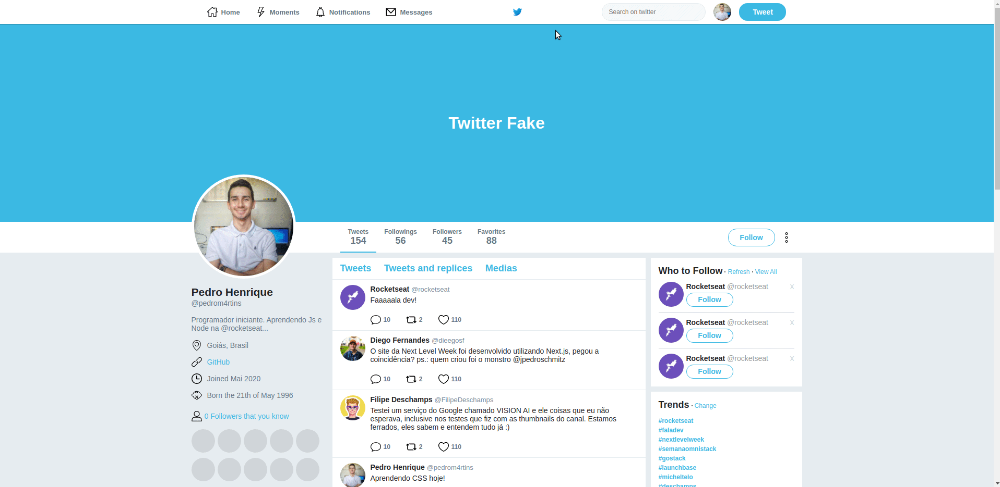

# Twitter Fake

Página clonada no meu aprendizado de CSS, focando no uso de flexbox...

## Objetivo

## Vizualização

Vizualize esse reporitório com o Github pages:
https://pedromartinscap.github.io/twitter-fake/

# Twitter Fake

## :blue_book: Projeto

O objetivo de copiar aplicativos e páginas é praticar a mais diversas habilidades e entender melhor o funcionamento aplicabilidade prática das ferramentas.

## :computer: Tecnologias

Foram usadas as seguintes tcnologias neste projeto:

- HTML + Flexbox
- CSS

## :smiley: Como vizualizar?

Basta Acessar esse link:

[Twitter Fake](https://pedromartinscap.github.io/twitter-fake/)

## Créditos

Os ícones utilizados na página foram baixados em [Flaticon.com](www.flaticon.com).

Feito com :blue_heart: por Pedro Henrique - [LinkedIn](https://www.linkedin.com/in/pedrohenriqueoliveiramartins/)